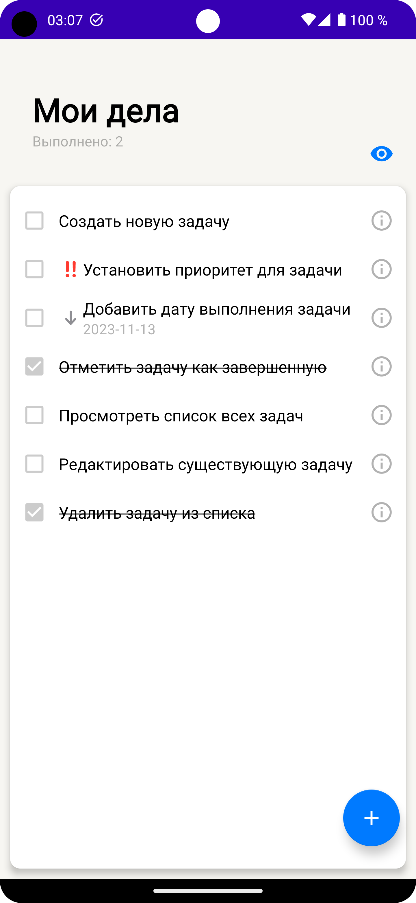
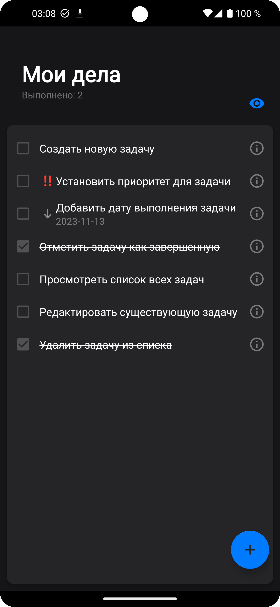
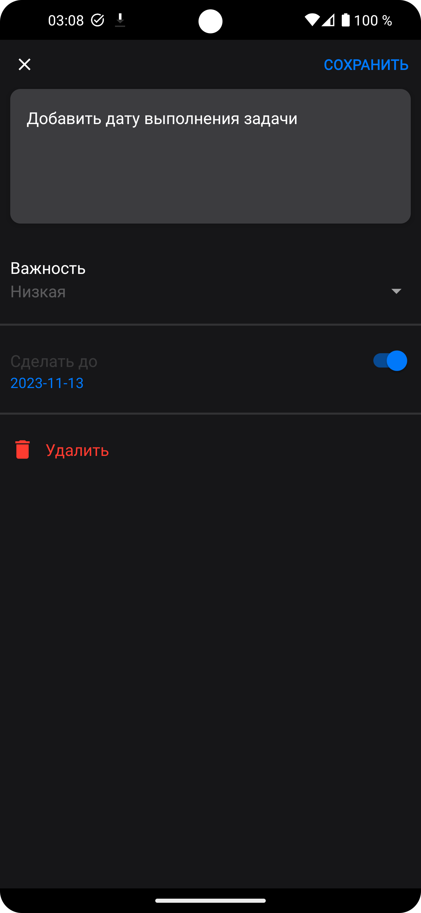

# ToDoApp [Android app]

## О приложении:

Тестовое приложение, которое позволяет управлять списком дел.
### Возможности:
+ Создавать задачи с различным приоритетом
+ Ставить дедлайны для задач
+ Скрывать/отображать выполненные задачи
+ Все изменения сохраняются на устройстве с помощью `Room`

Приложение использует принципы `Сlean architecture` и использует архитектуру `MVVM`

## Используемые технологии:
`Room` - для сохранения информации в базу данных
`Hilt` - для внедрения зависимостей 
`Kotlin coroutines` - для асинхронных операций 
`Fragments` - для перехода между экранами в рамках одной Activity
`navigation fragment` - для простой навигацией между фрагментами

## Изображения приложения:
  
